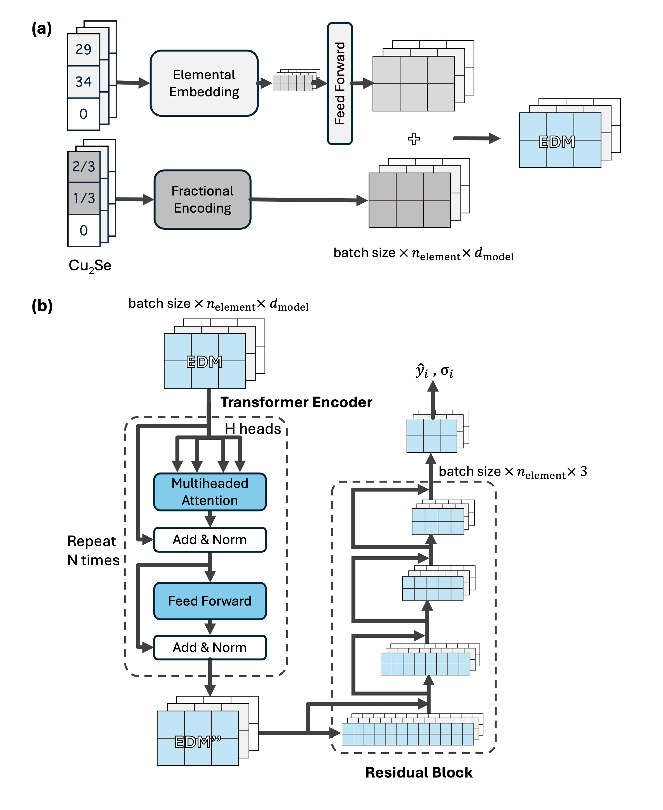
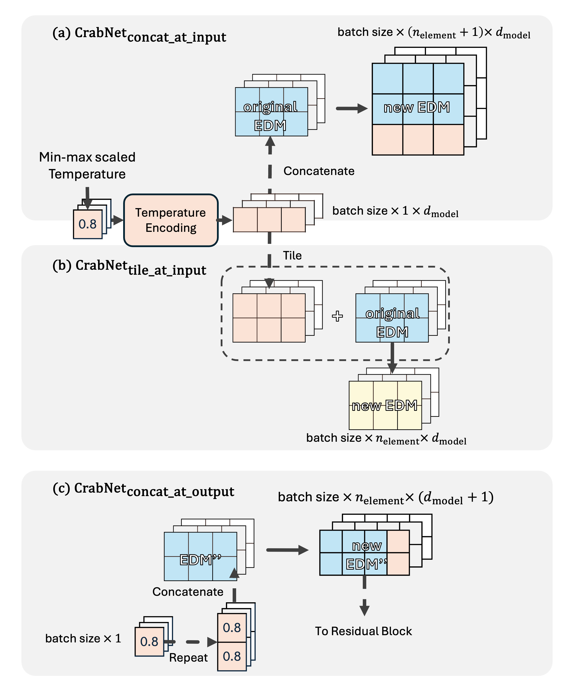
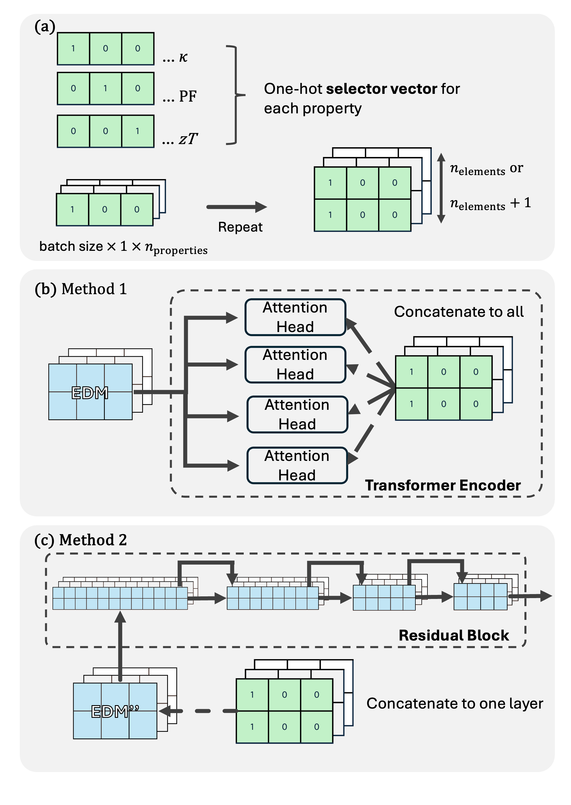

# Multi-task CrabNet for Thermoelectric Materials

## Description

This repository contains the results and code for the Multi-Task CrabNet (MT CrabNet). MT CrabNet is a modification of the original Compositionally restricted attention-based Network (CrabNet) model. There are two main modifications:

1. Adding external features (e.g, temperature) as inputs, to one of the layers in the model. There are a total of three different options, `concat_at_input`, `tile_at_input` and `concat_at_output`. 

2. Enabling multi-task learning with the use of selector vectors. The selector vectors indicate what target property is being learnt, and works even when there are some missing data. The selector vector can either be added to the start of the attention heads, or one of the layers in the residual block.

We hypothesize that the attention mechanism can implicitly learn composition-specific dopant effects, which traditional composition-based models tend to struggle with. Additionally, multi-task learning of related properties should also improve overall predictive accuracy. To investigate these deductions, we focused on thermoelectric (TE) properties prediction, since doping is one common strategy. The model was trained on an experimental TE dataset, called the Systematically Verified Thermoelectric (`sysTEm`) Dataset, which is a previous work of ours. 

Aside from MT CrabNet, the code for the baseline models (DopNet and Random Forest) used for comparison and the Single-Task Crabnet (ST CrabNet). This model is intended to be used for domains beyond TE materials. 

<p align="center">
  
  <br>
  <em>Figure 1: Original CrabNet architecture.</em>
</p>

<p align="center">
  
  <br>
  <em>Figure 2: Adding External Features (Absolute Temperature used as an example).</em>
</p>

<p align="center">
  
  <br>
  <em>Figure 3: Multi-task CrabNet with selector vectors.</em>
</p>

## How to Cite
If this repository has been useful for your work, please consider citing the paper, which is currently a preprint:

```
@misc{Tang_MultitaskAttentionDoped_2025,
  title = {Multi-Task Attention for Doped Thermoelectric Properties Prediction},
  author = {Tang, Leng Ze and Mohanty, Trupti and Baird, Sterling G. and Ng, Leonard W. T. and Sparks, Taylor D.},
  year = {2025},
  month = sep,
  publisher = {ChemRxiv},
  doi = {10.26434/chemrxiv-2025-jcgjz},
  url = {https://chemrxiv.org/engage/chemrxiv/article-details/68b42efda94eede154b776b1},
  urldate = {2025-09-03},
  archiveprefix = {ChemRxiv},
  keywords = {attention mechanism,doped materials,figure of merit,machine learning,materials informatics,multi-task learning,thermoelectric}
}
```

## Using the code in this repository

You are recommended to clone the entire repository. The `local_pkgs` folder contains modules for the different models, along with functions for generating figures and formatting data.


### Downloading the required dependencies
`conda` or `venv` can be used to install the required dependencies. There are different versions of the packages as different devices were used to run the models, and the CrabNet model that we modified had some known compatibility issues with newer `PyTorch` versions. Please see [Known issues with CrabNet right now](#known-issues-with-crabnet-right-now).


`environment.yml` - contains the dependencies for running a `conda` environment. This `pyTorch` version should work for CrabNet. All dependencies are listed in `full_dependencies_nometal.txt`.

`environment_with_metal.yml` - contains the dependencies for running a `conda` environment. The difference is from using a higher `PyTorch` version, so that metal support is enabled (used to run the DopNet models for e.g,). However, this WILL NOT work properly with CrabNet's dependencies. All dependencies are listed in `full_dependencies_metal.txt`.

`requirements.txt` - should work with `pip install`. Intended to work well with CUDA-based computers.

### Brief Overview of relevant folders and files

- `local_pkgs/`  
  Contains all core Python packages and modules for models, data processing, and utilities.  
  - `proj_pkg/`: Main project code (data handling, preprocessing, ML pipeline, plotting, etc.)
  - `dopnet_pkg/`: DopNet model code and related utilities.
  - `crabnet_pkg/`: Modified CrabNet and MT CrabNet code.

- `data/`  
  Contains input datasets and feature files used for training and evaluation. `dataset_formatting.ipynb` in root contains the code for generating these files from the original data.

- `training_models/`  
  Scripts for training models.

  - `results/`
 Contains the predictions by the various models.

- `figures/`  
  Output figures found in the work. `generating_figures.ipynb` in root contains the code for generating these figures


## Known issues with CrabNet right now

The latest CrabNet repository prior to this work had the following issues:
- CrabNet does not work with Python Versions > 3.10 https://github.com/sparks-baird/CrabNet/issues/78
- CrabNet needs PyTorch version < 2.0 https://github.com/sparks-baird/CrabNet/issues/70
-metal no metal diff (one for DopNet, one for CrabNet)

As we modified the CrabNet code directly, the issues are also carried over to our MT CrabNet and ST CrabNet models.

## Attributions
This repository adapted code from the following works:
 - https://github.com/sparks-baird/CrabNet/tree/main
 - https://github.com/ngs00/DopNet
